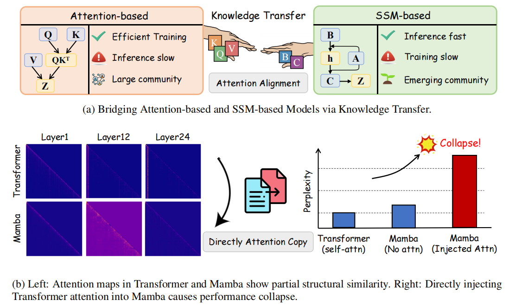
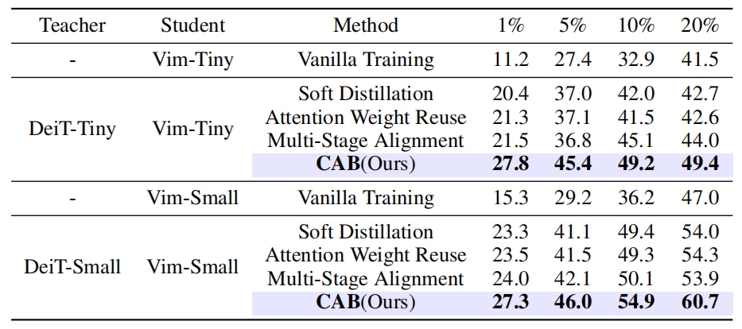
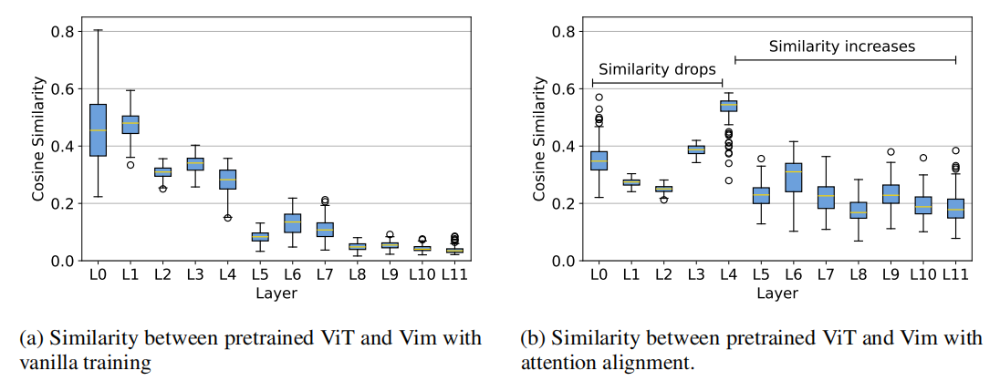

# 🚕 CAB: Data Efficient Any Transformer-to-Mamba Distillation via Attention Bridge
<div align="center">

<a href='https://arxiv.org/pdf/2510.19266'></a>
<a href='LICENSE'></a>
</div>

## ✨ Overview

*Figure 1: **Towards Effective Attention-to-SSM Distillation.**
We highlight the structural complementarity between attention-based and SSM-based models, and the limitations of direct attention transfer, motivating our proposed alignment-based distillation approach.*

CAB is a data-efficient framework for transferring attention knowledge from Transformer teachers to state-space student models such as Mamba.
It introduces a lightweight MLP-based bridge that aligns Transformer’s attention projections (Q/K) with Mamba’s dynamic projections (B/C), enabling fine-grained, token-level supervision.
CAB further adopts a hierarchical layer alignment strategy to handle architectural heterogeneity.
Across both vision and language tasks, CAB achieves superior performance and efficiency, demonstrating that attention-based inductive biases can be effectively transferred to recurrent models.
## 🔍 Key Features

*Figure 2: Top-1 accuracy comparison between pretraining and distillation methods on ImageNet classification under varying proportions of training data.*
- **Attention Bridge** – A lightweight MLP module that aligns Transformer attention (Q/K) with Mamba’s dynamic projections (B/C). This enables fine-grained, token-level supervision and allows effective transfer of attention structures into recurrent state-space models.
- **Dual Efficiency** – CAB achieves both computational and data efficiency: it avoids the heavy quadratic cost of dense attention alignment and remains effective in low-data regimes, making it a scalable solution for cross-architecture knowledge transfer.


*Figure 3:   Attention matrices similarity between Vim and pretrained ViT, comparing results with and without attention alignment. 
  Higher similarity indicates better alignment of attention representations.*

---

## ⚙️ Quick Start
We recommend Python **3.10+**.

###  Create Environment
```bash
conda create -n CAB python=3.10
conda activate CAB
````

### 🖼️ Vision Task Setup (vision_CAB)
```bash
# Install vision task dependencies
pip install -r requirements.txt
pip install -e causal_conv1d>=1.1.0
pip install -e mamba-1p1p1

# (Optional) Create a subset of the dataset, e.g., 10% of ImageNet
python create_subset.py 

# Run distillation
bash run_distill.sh
```
### 💬 Language Task Setup (phi_mamba_CAB)
```bash
# Install language task dependencies
pip install -r requirements.txt

# Run distillation
bash run.sh
```

---

## 🤝 Acknowledgements

This project builds on:

* [**Vim**](https://github.com/hustvl/Vim) — Vision Mamba: Efficient visual state-space models for image understanding.  
* [**Phi-Mamba**](https://github.com/goombalab/phi-mamba) — A Mamba-based language model for efficient sequence modeling.
* [**Attention Transfer**](https://github.com/alexlioralexli/attention-transfer) — A PyTorch implementation of attention-based knowledge distillation methods.

---

## 📄 License

This project is licensed under the **MIT License**. See the [LICENSE](LICENSE) file for details.

---

## 📚 Citation
If you find CAB useful, please cite our paper:

```
@misc{wang2025dataefficienttransformertomambadistillation,
      title={Data Efficient Any Transformer-to-Mamba Distillation via Attention Bridge}, 
      author={Penghao Wang and Yuhao Zhou and Mengxuan Wu and Panpan Zhang and Zhangyang Wang and Kai Wang},
      year={2025},
      eprint={2510.19266},
      archivePrefix={arXiv},
      primaryClass={cs.LG},
      url={https://arxiv.org/abs/2510.19266}, 
}
```

